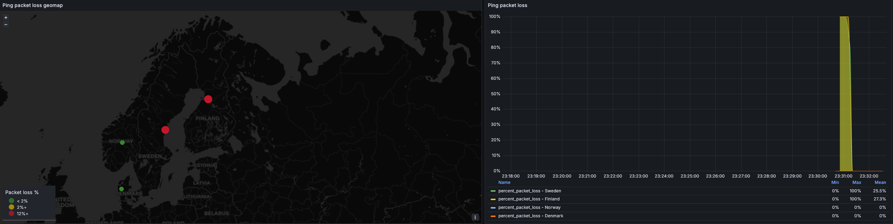

# clab-netobs

## A project demonstraing enrichin telegraf metrics via a graphql data source (netbox in this case) using a processor plugin.
To get this working you must build the required docker images first
```bash
vrnetlab/cisco_iol:17.15.01
telegraf:graphql -> https://github.com/emilvonck/telegraf/tree/graphql
```

## Add override to netbox
```bash
tee docker-compose.override.yml <<EOF
services:
  netbox:
    networks:
      netobs:
        ipv4_address: 198.51.100.100
    healthcheck:
      test: curl -f http://localhost:8080/login/ || exit 1
      start_period: 300s
      timeout: 3s
      interval: 15s
    environment:
      SKIP_SUPERUSER: "false"
      METRICS_ENABLED: "true"
  netbox-worker:
    networks:
      netobs:
        ipv4_address: 198.51.100.101
  netbox-housekeeping:
    networks:
      netobs:
        ipv4_address: 198.51.100.102
  # postgres
  postgres:
    networks:
      netobs:
        ipv4_address: 198.51.100.103
  # redis
  redis:
    networks:
      netobs:
        ipv4_address: 198.51.100.104
  redis-cache:
    networks:
      netobs:
        ipv4_address: 198.51.100.105

networks:
  netobs:
    external: true
EOF
```

## Once you have the required docker images, deploy the demo
```bash
make
```

## There will be a pre-provisioned dashboard showcasing the below




## To clean up
```bash
make destroy
```